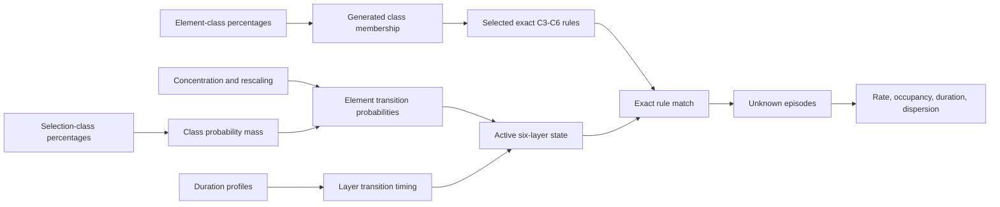
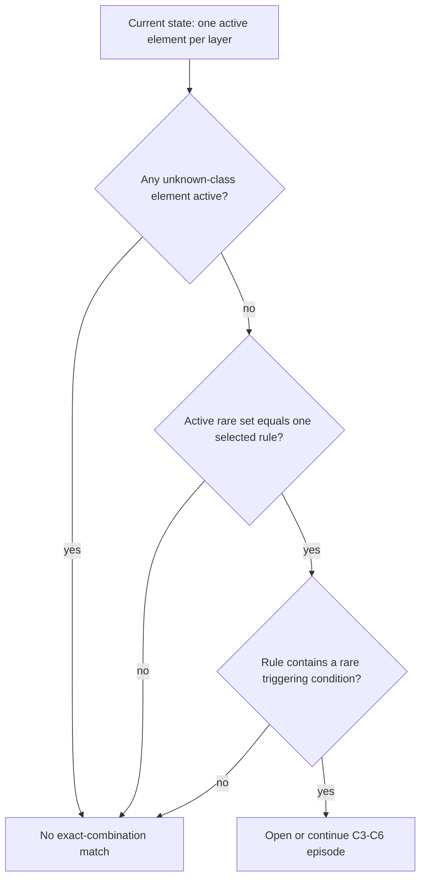
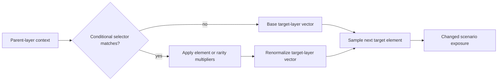
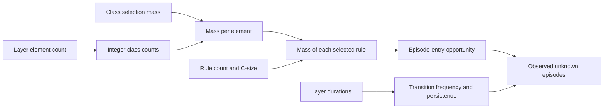

# Simulator and study diagrams

These diagrams accompany the generated plots and explain the model mechanisms
that response curves alone cannot show.

## Simulator mechanism

## Exact-combination matching

Every selected rule contains the triggering-condition layer by construction.
Layers not named by the rule must be common; extra rare elements invalidate the
match.

## Conditional-transition mechanism

## Taxonomy-to-risk pathway

